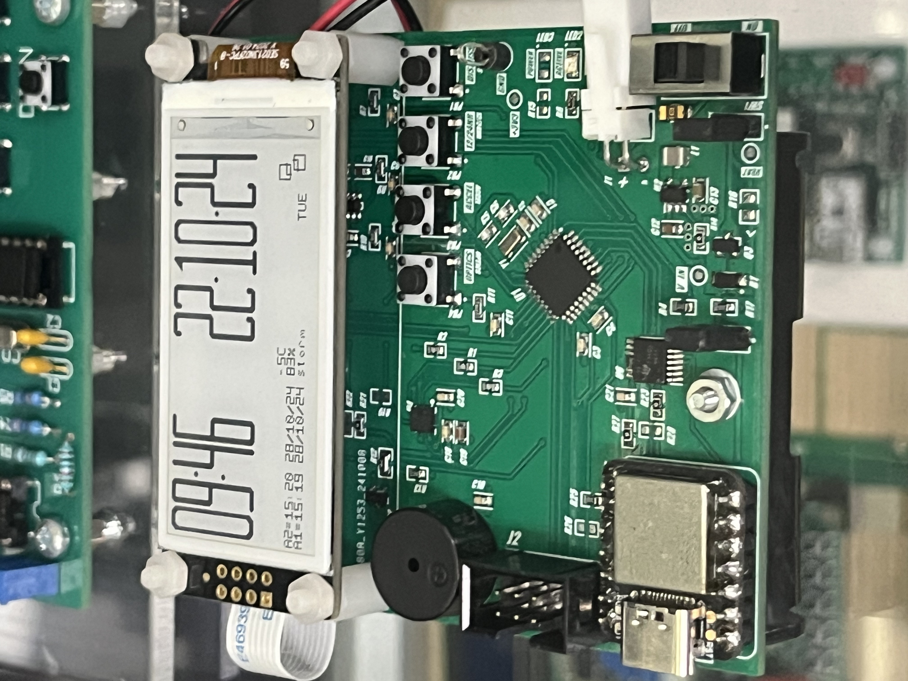
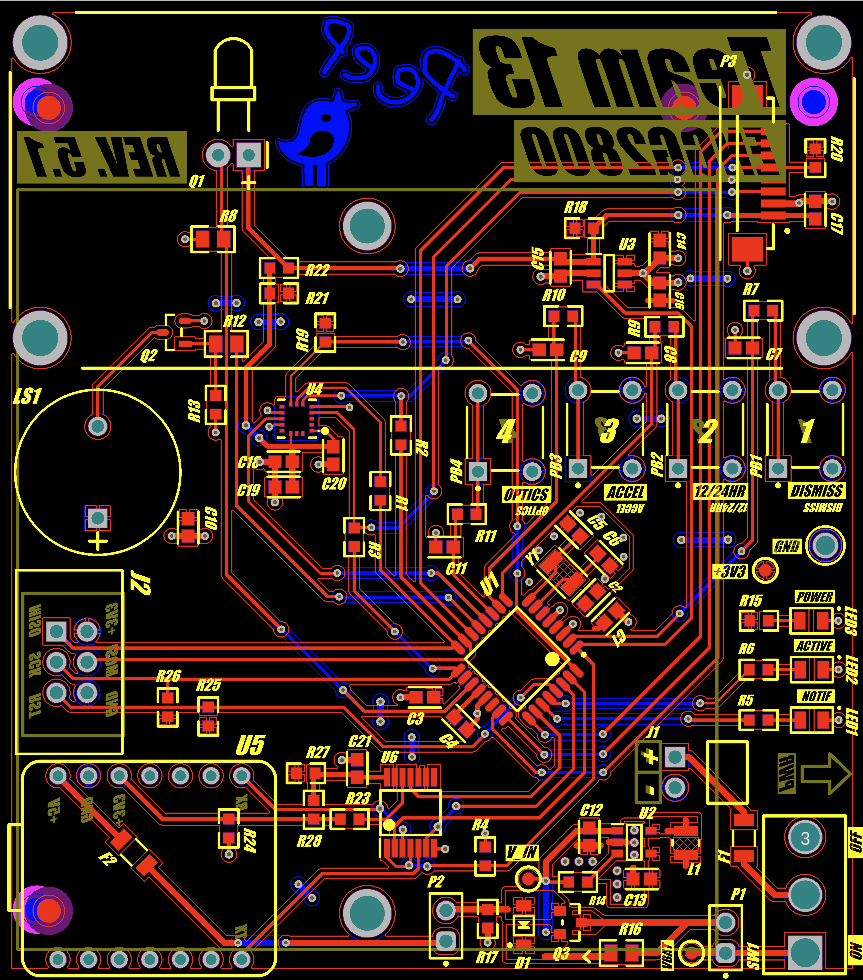

# peep
A showcase of peep :)

peep — Personal E-paper Enhanced Portable 

Pocket-watch–style personal organiser powered by an ATmega328P and an e-paper display.

## ✨ Features
- ATmega328P @ 8 MHz (low-power tuned)
- Real-time clock and alarm functionality.
- Configurable via GUI software on PC. 
- <50 µA current draw (5 second avg.)
- PCB designed in Altium. 

## Schematic ⚡
[Peep Schematic (PDF)](Schematic%20PDF_V01.pdf)

## 📸 Gallery

  
  
  

